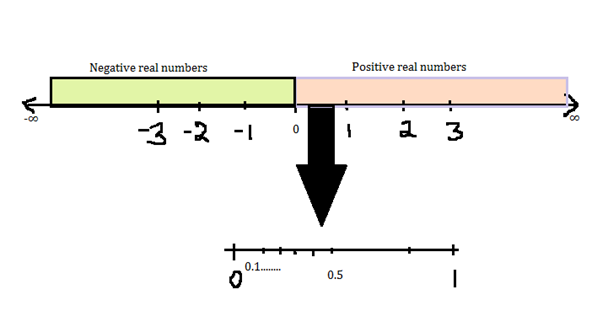
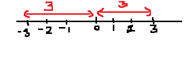

**Set Theory**

**Cardinality:** Size of the set is also called as Cardinality.
i.e., number of elements in the set.
For ex:
Consider set A= {1,8, -2,6}
Cardinality is represented by |A|= 4

**Intersection of sets:**
Consider two sets, A= {2,3,5,6,7} and B= {4,0,2,5,9}
then, A ∩ B = {2,5} i.e., the elements found common in both the sets.
In other words, performing 'AND' operation on sets results in A ∩ B.

**Union of sets:**
Consider two sets, A= {2,3,5,6,7} and B= {4,0,2,5,9}
then, A U B = {2,3,5,6,7,4,0,9} 
In other words, performing 'OR' operation on sets results in A U B.

**Infinite World:**

**Real numbers:** The type of number we normally use, such as 1, 15.82, −0.1, 3/4, etc. Positive or negative, large or small, whole numbers or decimal numbers are all Real Numbers. They are called "Real Numbers" because they are not Imaginary Numbers.

Consider an infinite number line, we can see that the numbers on the right of zero are positive real numbers and to the left of zero are negative real numbers.
Consider two points on the number line. For ex, 0 and 0.1
There are infinite real numbers between 0 and 0.1. i.e. 0.01,0.011,0.0111……….,∞
 
**Absolute Value:**
The absolute value of a number x, |x|, is the distance from x to 0.

                                
Example:
|3| = 3
|−3| = 3 = −(−3)
